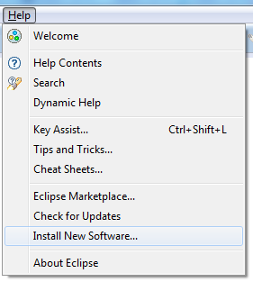

**Autor:** José Antonio Vacas Martínez

**Versión** 1.1

**Fecha**: Enero 2014

Material de "Digital Learning"


Tema 2: Instalación y primeros pasos
====================================

2.1 Introducción y objetivos
        ----------------------------

En este tema vamos a conocer el entorno que vamos a utilizar para
desarrollar en Java. Aprenderemos:

-   Instalar el entorno de desarrollo JDK

-   Instalar, manejar y conocer las características de Eclipse, el IDE
    (entorno de desarrollo integrado) que utilizaremos en el curso

-   Desarrollar nuestro primer programa Java con dicha herramienta

2.2 Instalación del JDK
        -----------------------

Para programar en Java vamos a necesitar el Java Development Kit o JDK.
Es el entorno de desarrollo de Java y contiene todo lo necesario para
que podamos generar programas en este lenguaje.

La mayoría de los ordenadores de hoy en día ya disponen de un entorno de
ejecución de Java o Java Runtime Environmet (JRE), pero este no es
suficiente para poder generar programas.

Para instalar el JDK, sólo necesitamos conectarnos a
[*http://developer.java.sun.com*](http://developer.java.sun.com/) que
nos redireccionará a Oracle y a la página de las descargas donde
seleccionaremos Java SE y en la ahí la pestaña de descargas

{width="6.6930555555555555in"
height="5.240972222222222in"}

Pulsamos sobre la opción de Download Java Platform (JDK) y obtendremos
una lista con las posibles descargas según nuestro sistema operativo

{width="6.6930555555555555in"
height="3.9305555555555554in"}

2.3 IDE (Entorno de Desarrollo Integrado)
    -----------------------------------------

Aunque el JDK tiene lo necesario para desarrollar en Java no incluye
ningún entorno de desarrollo en el sentido moderno es decir, un potente
editor y un sistema que nos permite compilar y depurar nuestras
aplicaciones.

Realmente cualquier editor de texto nos permite editar el código Java y
la compilación del mismo se puede realizar desde línea de comandos sin
mayor problema, pero si queremos desarrollar con agilidad necesitaremos
un IDE que nos va facilitar enormemente las cosas.

Nosotros elegiremos Eclipse puesto que es la plataforma escogida por
Google para desarrollar aplicaciones Android (por el momento puesto que
se ha iniciado el desarrollo de otro entorno denominado Android Studio,
todavía en fase alfa de desarrollo) si bien es cierto que se pueden
utilizar otras plataformas, como el mismo Netbeans.

Eclipse es un entorno multiplataforma, escrito en Java que nos permite
desarrollar en muchos lenguajes (java, php, Javascript, Python, C, C++
etc. ) y con diferentes entornos.

Además permite el añadir plugins o complementos que amplían su
funcionalidad prácticamente hasta el infinito.

Está pensado para proporcionar al programador todo lo que necesita en
sus diversas tareas, desde la programación hasta la creación de bases de
datos, pasando por la gestión de errores.

### 2.3.1 Instalación de Eclipse

Para instalar Eclipse nos conectamos a su página y descargamos el
paquete que suele ser un zip que descomprimimos donde queramos desde la
sección de descargas
[*http://www.eclipse.org/downloads/*](http://www.eclipse.org/downloads/)
.

{width="6.6930555555555555in"
height="6.460416666666666in"}

La versión más reciente suele estar resaltada arriba de la lista del
resto de versión. Como hemos dicho, Eclipse es un entorno modular y
existen muchas versión personalizadas para distintos lenguajes de
programación y para distintos tipos de desarrollo (desarrollo de
aplicaciones visuales, de tipo web, de informes, etc.)

Esta versión destacada suele ser la versión Standard que incluye los
plugins más usados. En cualquier caso, si llega el momento y necesitamos
un plugin que no tenemos siempre se puede instalar.

2.4 Primer programa: Hello Java World!
--------------------------------------

Vamos a hacer nuestro primer programa, el habitual “Hello Java World”

En el vídeo vemos todos los pasos que hay que realizar para crear el
programa.

El código sería

``` java
package com.curso.hjw;

public class HelloJavaWorld {

/*
Este programa es un típico Hello Java World
El primer programa que todo  programador suele hacer
*/

  public static void main(String\[\] args) {

    System.*out*.println("Hello Java World!!");

  }

}


```
Este código se incluirá en un fichero que por norma se llamará igual que la clase, es decir  **HelloJavaWorld.java** en este caso. En Java se suele nombrar a las clases (que es la entidad mínima de código) con la letra inicial mayúscula.

Todo programa Java tiene un método main que escribiremos de la misma
forma que en este ejemplo. Ese será el primer método al que se llamará
cuando ejecutemos nuestro programa.

Algunas de las partes del programa son obligatorias como por ejemplo la
parte de “public class ...” y otras recomendadas como “package...”.

Estas partes y todo lo relacionado con POO (Programación Orientada a
Objetos) lo veremos en el tema 4.

Iremos viendo el significado y el sentido de cada una de ellas más
adelante. De momento saber que deben estar y que System.out.print nos
sirve para imprimir datos y que el usuario los vea.

Para ejecutar el programa basta con pulsar el botón Ejecutar
<center>

</center>

El entorno va compilando directamente nuestra aplicación y pulsamos el
botón la ejecuta.

Este mismo proceso podríamos haberlo hecho manualmente sin el IDE
utilizando sólo las herramientas que incluye el JDK.

Lo compilaríamos con

> javac HelloJavaWorld.java

Y para ejecutarlo invocaríamos a la máquina virtual Java con

> java HelloJavaWorld

### 2.5 Usando eclipse

Eclipse es un entorno muy potente y por esto el tener tanta
funcionalidad puede parecer que lo hace difícil de usar.

Una de las características que más puede despistar al principio es que
no siempre se ven las mismas ventanas, sino que dependiendo del contexto
se muestran unas u otras.

Vamos a ver las principales características. Podemos ver una visión
general en el vídeo sobre este tema.

### 2.5.1 Proyectos

Por proyecto en Eclipse (y en la mayoría de entornos de desarrollo)
entendemos un conjunto de código que genera un ejecutable. Se incluyen
los ficheros que contienen el código, los ficheros de configuración y
cuantos ficheros son necesarios para producir el ejecutable final
(imágenes, sonidos, etc que se necesiten).

Además de nuestro código se incluyen librerías que contienen el código
esencial de Java que utilizaremos desde nuestro propio código.

Veamos en la siguiente imagen un proyecto Java, con el código en la
carpeta src, que incluye el paquete com.curso.hjw y el fichero
HelloWorldJava.java, además de las librerías del JRE 1.7


### 2.5.2 Perspectivas

Dado que el trabajo del programador de Java tiene diferentes facetas:
escritura de código, pruebas, arreglo de errores, redacción de
documentación, casi todos los entornos permiten que ser configurados con
varios aspectos y conjuntos de ventas abiertas diferentes para cada
tarea.

Eclipse denomina a esta configuración del entorno perspectivas y existen
diversas perspectivas para diferentes tareas.

También existen diferentes perspectivas para diferentes lenguajes de
programación.

Cada una de estas perspectivas se guarda con sus características y
podemos acceder a las mismas desde la barra de perspectivas de Eclipse,
que podemos ver en la imagen siguiente, donde se ha seleccionado la
perspectiva C/C++

{width="3.1770833333333335in"
height="0.3854166666666667in"}

Las perspectivas más usadas quedarán visibles en la barra. Si alguna no
aparece podemos seleccionarla pulsado el primer icono de la barra de
perspectivas.

### 2.5.3 Vistas

Eclipse estás constituido por multitud de ventanas que se denominan
vistas, cada una de las cuales tienen una funcionalidad distintas.

Existen vistas que nos permiten ver qué valor tiene una variable o que
tareas tenemos pendientes.

Las perspectivas que antes mencionábamos están formadas por diversas
vistas. En cualquier momento podemos añadir nuevas vistas sin más que
buscarlas en la opción Show View del menú Windows

{width="5.104166666666667in"
height="4.479166666666667in"}

### 2.5.4 Plugins

Una de las características más útiles de Eclipse es su capacidad para
incluir plugins. Un plugin o complemento es un programa (o librería) que
aporta una nueva funcionalidad a Eclipse y se integra en sus menús y
opción.

Existen plugins para multitud de tareas, como puede ser gestión de
código ( gestión de cambios de código Git, SVN, etc. ), gestión de bases
de datos, gestión de errores del software, etc...

Podemos añadir nuevos plugins desde la opción “Install new software del
menú Help

### {width="2.9270833333333335in" height="3.2604166666666665in"}

Lo que nos lleva a la pantalla de selección de plugins

{width="6.6930555555555555in"
height="5.2375in"}

1.  ### \

    ### 2.5.5 Workspace

Algo muy frecuente es que nuestro trabajo nos implique desarrollar
varios proyectos simultáneamente o que tengamos que dividir nuestro
tiempo entre varios proyectos (no proyectos de código sino proyecto en
sentido real). De ahí que exista el concepto de espaciador.

Un workspace nos va a permitir agrupar varios proyectos de código de una
forma sencilla. Físicamente todos los proyectos colgarán de una misma
carpeta que será a la que llamaremos workspace.

{width="5.916666666666667in"
height="2.8541666666666665in"}

Podemos tener todos los workspace que queramos, pero sólo podremos
trabajar con uno al mismo tiempo.

Al entrar en Eclipse, si no decimos lo contrario se nos preguntará cuál
queremos usar. Si siempre vamos a usar el mismo podemos marcar la opción
para que no se nos pregunte más y siempre se use el elegido.

En todo momento podemos crear un nuevo workspace desde la opción de Menú
File y la opción Switch Workspace

1.  ###

    ### 2.5.6 Depuración

Si hay una tarea en la se invierte una gran cantidad de tiempo cuando se
programa es en la depuración.

La depuración consiste en encontrar errores en nuestro programa y
corregirlos.

Para ello ejecutaremos el programa y veremos si se comporta como
esperábamos. También podemos seguir la ejecución del programa viendo qué
parte del código se está ejecutando en cada momento, así como los
valores de las variables.

Elegiremos el modo de probar nuestro programa desde la barra de
depuración:

{width="1.5208333333333333in"
height="0.3229166666666667in"}

Podemos detener la ejecución en un punto concreto del código
estableciendo lo que denominamos un Punto de Ruptura o Breakpoint. Las
líneas con Breakpoints vienen indicadas con un círculo azul a la
izquierda de la línea.

{width="4.760416666666667in"
height="0.6979166666666666in"}

En eclipse existe una perspectiva que se denomina Debug y que nos
muestra las vistas que se usan más frecuentemente cuando estamos
depurando.

En el vídeo sobre depuración se indica cómo depurar y las principales
opciones.

1.  

    2.6 Lecturas recomendadas
    -------------------------

Para ampliar podemos revisar

Hello Netbeans World:
[*http://docs.oracle.com/javase/tutorial/getStarted/cupojava/netbeans.html*](http://docs.oracle.com/javase/tutorial/getStarted/cupojava/netbeans.html)

[*http://docs.oracle.com/javase/tutorial/reallybigindex.html*](http://docs.oracle.com/javase/tutorial/reallybigindex.html)

Cómo hacer un programa java en Netbeans
